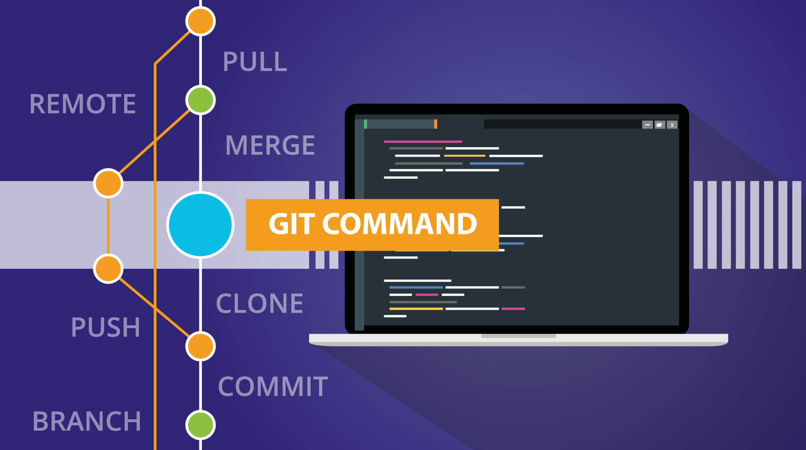

# Git Questions
Inside this repository, you'll find an extensive collection of meticulously curated Git questions and answers. From the fundamental concepts like branching, merging, and committing to advanced topics such as rebasing, cherry-picking, and managing submodules, we've got you covered.

## Contribute
Pull requests are welcome.

## Table of Contents
- [Git Questions](#git-questions)
  - [Getting Started](#getting-started)
  - [Branch & Merge](#branch--merge)
  - [Advanced Topics](#advanced-topics)

## Getting Started
To make copy and pasting easier, set the environment variable `GIT_URL` to the repository URL.

```
export GIT_URL=https://github.com/jcormir/git-questions.git
```

### Create a new repository
Create an empty Git repository or reinitialize an existing one.

```
git init
```

### Clone repository recursively
Clone a repository and submodules. *2.13+*

```
git clone --recurse-submodules $GIT_URL
```

## Branch & Merge
Whether you're working by yourself or on a team, you should have a repository work flow
that involves merging branches. Feature branches, long term release branches, etc.

### Branch
New local branch based on HEAD.

```
git branch <new-branch>
```

### Branch from existing branch
New local branch from existing branch.

```
git branch <new-branch> <base-branch>
```

### Branch from a specific commit or tag
If you want to start your new local branch based on a specific commit or tag, then
you can provide the commit hash or tag name as the starting point.

```
git branch <new-branch> <commit/tag>
```

### Branch a remote repository
After working on your new local branch for some time, you might want to publish it in your
remote repository, to share it with your team:

```
git push -u origin <local-branch>
```

The `-u` flag tells Git to establish a tracking connection, which will make push and pull much
easier in the future.

## Advanced Topics
Rebasing, cherry-picking, and managing submodules.